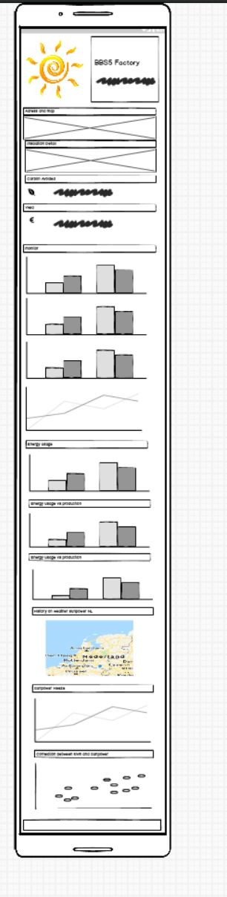

# Energy Factory BB55 Milestone 2
## Eneryg monitor Dashboard
By Yvett Smith

This Dashboard will be used mainly by a owner of solar pannels. To have an overwiew of the monthly, daily enery that was produced by the solor pannels. 

The user will also be able to do inspection on usaged and production also will have and idea what is the impact of the sunpower forcast on the production.

Click [here](https://lemoenskil.github.io/Milestone2-_BBS5_Factory_dashbord/) to see the website.

## UX
This Dashboard if for a home solar panel owner.  The owner will use this dashbord to get an overview of the production on the historical data   

### Strategy plane

#### Create a website for a Engineering Consulting Company bSentient
    
Build  Interactive Dashboard for a Home solar panel installation. 

The Dashboard has the following requirements:
    • Their primary target audiences are owners or prospective owners of Solar Home Installation
    • The Dashboard need to include the following 
	-installation address and location.
	-installation summery
	-Totals for carbon avoided and Euro earned
	-Graphs that show the daily and monthly and yearly production in kWh.
	-Graph that show the monthly usage compare to production
	-Heat map showing sun power weather data for on the Netherlands
	-Line Graph showing the sun power over the location of the solar installation.
	-Scatterplot showing the correlation between sun energy and power production
	
    • I need the following for the dashboard
	-photo of the installation
	-Summery of the installation
	-data file of kWh produced
	-Data of consumed energy
	-information on tariff and carbon avoided
	-Weather data (knmi)
    • Need a selector to choose the year and one to choose between euro and kWh
    • A map is also need to show the installation location

#### User stories:
Stories:
•	As a user, I'd like to see clean, well presented data in easy to understand/read format (graphs, charts, etc…)
•	As a user, I'd like to see a variety of charts/graphs to show different data in the dataset
•	As a user, I’d like for the dashboard to be made so that it will work and adapt to all manner of devices (responsive design)
•	As a user, I'd like to see some text to explain the data/statistics being seen on screen, giving further knowledge/context to the data being displayed
•	As a user, I'd like to see engaging use of colour making the dashboard pleasant to look at and keeping the user interested
•	As a user, I'd like to see easy to read font format for both the title/heading and all other writing on the dashboard
•	As a user, I'd like to be able to see the difference between kWh, Euro’s
•	As a user, I’d like to be able to have an overview of day, month and year data
•	As a user I’d like to be to compare data from the weather with my solor production
•	As a user, I'd like to be able to reset all the filters placed through clicks on the graphs with a simple button (therefore reverting the data shown on the graphs back to the default data)

#### Putting it all in the strategy plane

Project Purpose
I am creating a Data dashboard aimed towards helping current and prospective home solar panel installation owner getting an overview of their production, yield, carbon avoided  and cost.
The data dashboard will use both D3 and DC to plot multiple charts that will focus on different aspects of the dataset that I am using. The information I will mainly focus on is the energy/power production per day month and year.  I will only include the data from the date of installation from 19 September.   The usage date will be from Jan 2019.   
The dashboard will also include google map api, and a weather api  the get the data of the correlation map between the energy and sun power.
Why would a user want this?
In the current state of global warming solar power is a hot topic.  The user will not only want to save the planet but also want to see what is in it for him, and that will be financially.   Also as a user is would be nice to have a look as historical weather data do see what the correlation is between the weather and the production will be.
The user will also want it to get a one page overview in of his current production vs usage this can help in decisions for example extending the capacity of using the current capacity better.  (example if you want to move from the gas supply to only electrical)
Why is this so special?
The Data dashboard will stand out as it will have graphs that are easy to read and comprehend, and these will present the dataset in a way that provides the user with all of the required information,.
User Experience
There will be clean, well presented data in easy to understand/read format (graphs, charts, etc…), this will be the main draw to the dashboard.
The dashboard will also have responsive design, so it can display correctly on mobile devices, right through to large desktops, therefore allowing the information to be accessed and viewed properly no matter where you are or what device you are using.
There will also be summaries with some text included on the page to explain the data/statistics being seen on screen, giving further knowledge/context to the data being displayed.

    
### Scope Plane
    What they say they need
    • A Dashboard.
    • View their historical data
    • See profit made
    • Show that they are contrubuting to geener future

    What they actually need
    • Response Dashboard.
    • That can be viewed on a mobile.
    • Gives totals on montly, yearly and daily 
    

### Structure Plane

Information Architecture
Will be a simple tree structure using a horizontal bar near the top of the page taking up the right        two thirds of the page.
Interaction Design (IXD)
    • The Navbar will have the name of the istalation and a logo
    • For the color schem a bootwatch slate will be used.
    • One page sectins  will be used with a grid to it.
    • There will be a footer at the end that redirect you back to the top
    
### Skeleton Plane

#### mock-ups:

In the links below you can see the mock-up’s that I drew using the mock-up tool “Balsamiq”:

- 
**Note that the final design has changed from the original design in the mock-ups. The reason why it has changed.  I was trying different layouts while I was experimenting and learning the code and sometimes the new designs looked better than the original ones, or was just more responsive. In the desktop design the block with information was not that dominant which I have changed.   Made it bigger and put is on the background picture with a carousel.   Also have I cantered the Main information block and added a modal with a button.  On the mobile design I have added no picture and have just made use of the info block and made sure the button was visible for the user.  I have also replaced the logo at the footer and put the links for contact and social media*

## Features

### Existing Features
#### Feature 1 - Navigation bar
The navigation bar allows users to navigate the site by clicking on links to other pages.  Clicking on the Logo will also take you back to the homepage.  On the Navigation is also Brand name if you hover over it will change colour
The alert bar also takes you to the contact page.  Then the collapses 'burger icon' dropdown menu in mobile screen sizes to reduce over-crowding and improve user experience.

#### Feature 2 - Jumbotrons 
Jumbotrons with transparent background has in the top section of the landing page. A button modal with a form

#### Feature 3 - Carousel of images of the band at top of 'About' page
These large block display, different blocks of what the company can do.
Users can let the carousel play or select the left and right or the navigation dots beneath the images to move through the carousel.

#### Feature 4 - Embedded video link
A 'video' is embedded into the product page which users can press play and pause on at any time to view

#### Feature 5 - Small images with 'social media link and email link to contact'
This is a gallery of the owners with a link to linked in and a email address some of the owners do not have a linked profile yet

#### Feature 6 - Social media links in footer and contact icon
The footer at the bottom of the page has for mobile display only the links and the contact us on which has a hovering colour change.
In desktop mode the footer has a logo which link you back to the home page.

#### Feature 7 - Sign up modal and contact form
The home page has a modal with a contact us with a form to complete with no require fields

#### Feature 8 - 'Contact Us' form on 'contact' page
This form allows users to submit a query by filling out the email, contact number and selection field and a radio button fields and submit their enquiry.
The form checks for a valid email address, first and last name when entered fields are required (the enquiry cannot be submitted unless these fields are completed).

#### Feature 9 - 'download power point on new page'
On the training page you get a link where you can download a presentation

### Features Left to Implement
#### Feature 1 - Add links to small jumbotrons in landing page 
Would put in pictures and links to the service page in this carousel.
#### Feature 2 – To add required field to the form in the modal

## Technologies Used

- AWS cloud9
- Balsamiq
- HTML5
- CSS3
- Bootstrap
- Microsoft office (to draw up UX and excel)
- Adobe (convert to)
- Font awesome
- GIT
- GITHUB
- Google Chrome developer tools
- Cloud 9 IDE
- Javascript and JQuery.

## Testing

### Validation

- Used https://validator.w3.org/ in order to validate the HTML code.
- Used https://jigsaw.w3.org/css-validator/ in order to validate the CSS code.
After running the validation there was a few errors typos, obsolete and wrong attributes,). there were also warnings which i mostly ignored.

### Features and responsiveness testing
Testing the website page by page, checking every feature in all possible screen sizes.

See attached sheet made for testing the responsiveness for mobile to desktop

Click [here]() to see the list use to test the responsiveness

### Additional testing
Used development tools in Google Chrome to check how the website would look in different devices. Also used it to try different style and ideas.   
Also did intensive testing on links.    Also checked the form on the contact page if the required field did their job

### Problems and bugs:
- Had bugs and problems with padding and margin where it went to creative and had overflow on the sides.  
Also had buggs where my div did not align up properly   I also had to call in the help of a tutor which help me
- to use the! Important function to overwrite bootstrap settings..

## Deployment
This site is coded in Cloud9 IDE, a local Git directory was used for version control. It is hosted by using GitHub, deployed directly from the master branch. The deployed site will update automatically upon new commits to the master branch. In order for the site to deploy correctly on GitHub pages, the landing page must be named index.html.  I have ran regular commits after every important update to the code, and I pushed the changes to GitHub pages.
Once in a GITHUB repositories it was made live using GITHUB Pages. The website can be found at: https://github.com/Lemoenskil/milestoneoneproject/

## Credits

### Content
Took content on training.html form webpage https://objectcomputing.com/services/software-engineering/resources/5-reasons-to-transition-to-open-source.   And the content of product.html form the website https://staraid.ai/

### Media
Video used are on YouTube and website https://staraid.ai/
- 
### Photos used:
Pictures used for background
Credit information for each image in this collection is listed below. Simply match the image ID numbers below to the ID number in the image file name to credit the proper image.
More about usage rights can be found here:
https://www.dreamstime.com/terms#using

- Image ID: 140964942
    Copyright Siarhei Yurchanka | Dreamstime.com
    https://www.dreamstime.com/yur4you_info
    
- Image ID: 134781260
    Copyright Siarhei Yurchanka | Dreamstime.com
    https://www.dreamstime.com/yur4you_info
    
- Image ID: 111718113
    Copyright Vs1489 | Dreamstime.com
    https://www.dreamstime.com/vs1489_info

- Image ID: 96999098
    Copyright Allexxandar | Dreamstime.com
    https://www.dreamstime.com/allexxandar_info

### Download
for business case comes form the customer Signify

### Work based on other code
the desktop navbar was re-used from the mini-project,
the jumbotron was used for the whiskey drop-project

### Acknowledgements
Thanks to my husband for playing the customer
Also, family and friend giving feedback on the UX
Also, thanks to my mentor Spencer helping my put some order in chaos and thanks to the tutors helping me with the hamburger menu and background pictures
